# QSelf_Project_Weightlifting_Tracker

git: https://github.com/UncleBen420/QSelf_Project_Weightlifting_Tracker

The goal of this project is to extract, prepare and analyze data of a weightlifting session. The data will be in the form of a time data series of accelerometer and heart rate. The data represent a session of weightlifting exercises such as squat, bench press,... As a normal training, each movement is repeated a dozen of time. Between each set, some random activities could be performed such as drinking water, walking, being seat.
A second objective of the project is to find a model to predict which movement has been made. We'll try some more mathematical options and other through machine learning. It will be interesting to see how the model can differentiate exercises from random activities.
Once the series of exercises are extracted, we will extract information of every series of exercise: number of repetitions, calories burned and heart rate.
This will allow us to create a review of the training session by knowing which exercise has been done, how many series by exercise, how many repetitions by series, the total calories burned and the heart rate across the training session.

## Data capture

To capture the data, we used 2 Polar OH1, one on the left foot (left side of the ankle), another one on the left arm like a watch, as shown below:

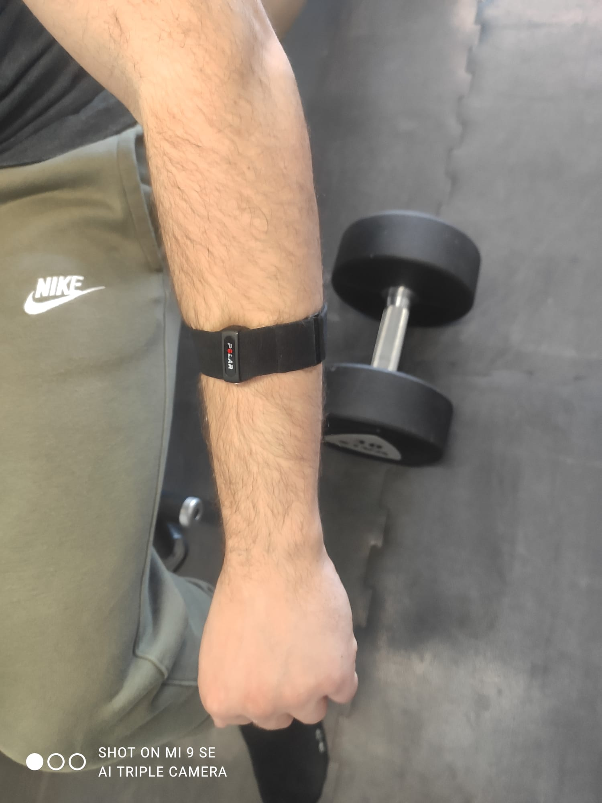
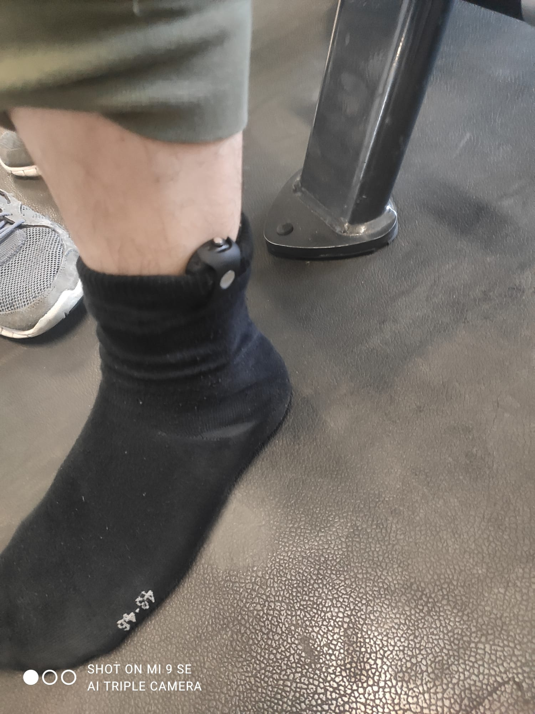

The polars allow us to capture accelerations on 3 axis at 2 positions and the heart rate. We need 2 captors to ensure a well recognition of the movements. Indeed, some exercises require large movements from an unique part of the body only. Taking pull-up as an example, the lower body part is moving upward while the arm remains almost immobile. Idem, when you are using a leg's machine, there is strong probability that the movements of your arm won't correlate with the exercise done. This is for this reason that a captor on the foot is needed.

For the sake of testing multiple models, we have capture 3 types of data:

- training session simulation: a time series of a test session of exercises, this time series comports 3 series of exercises, 2 series of bench press and 1 of squat. each exercise as multiple repetitions and are separated by random activities.

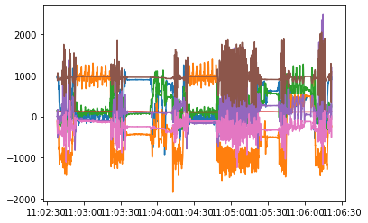

- series of exercises: those time, series are only a specific movement with multiple repetitions. For example, 5 times a squat movement. Here below is the recording for Deadlift movements :

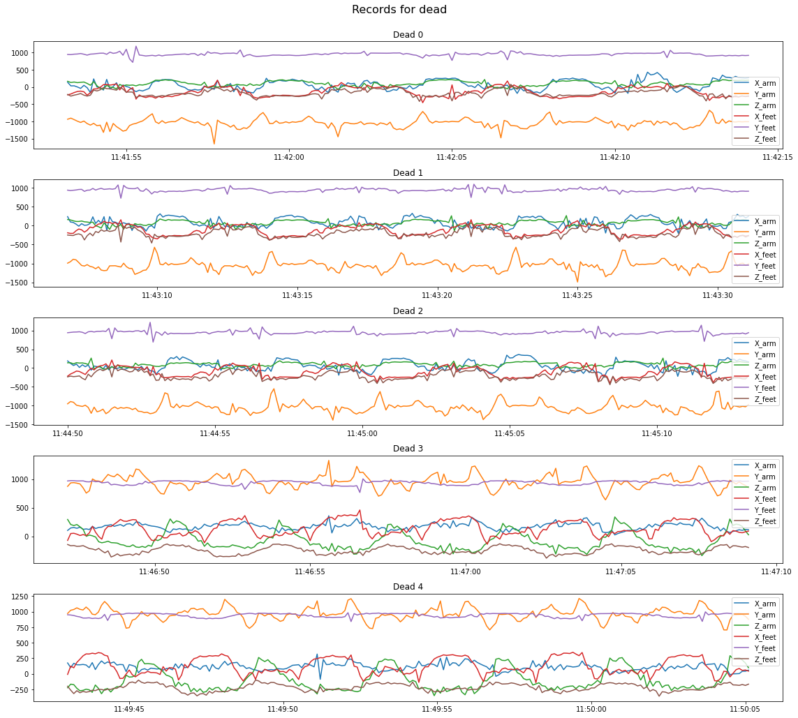

- isolated movement: a time series representing only 1 movement, for example, just 1 squat or just 1 bench press. Here, is an example of an isolated Squat movement:

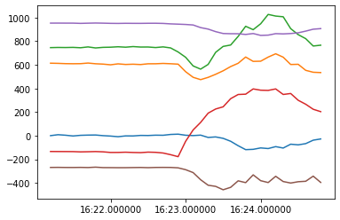

To begin our project, we only capture basic exercises: Bench press, Squat, Over head press, Deadlift and Pullup.

## Data preparation

A very important step in data science that take time, is to prepare data to be processed. One thing that have bothered us, was the fact that the time stamp of the records of each captor don't match. For example, the arm captor will have a record at 1 second and 100 centimes and the second captor will have a record at 1 second and 98 centimes. So, to do a merge of data, we had to re sample it at 0,1 second for each sample. This is enough since we do not need a lot of precision to analyze the data. Here, are examples of a series of exercise

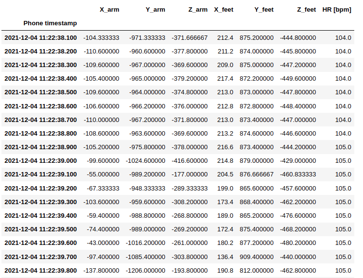

## FFT

To isolate the series of movements, we have try to use a FFT. This method is purely mathematical and doesn't require machine learning. The idea was, when we perform an exercise, we do a repeated movement multiple times. This creates a low frequency. If we take approximately 2 seconds to perform a movement, we can expect a frequency of 0.5 (the sample rate is note took into account in this example). We have succeed to prove that we can find a pic at low frequency in a FFT of an isolated exercise series:

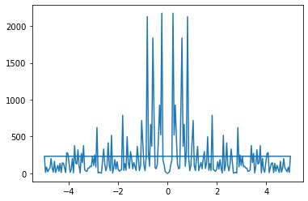

 Next, we have done a rolling FFT (a FFT on a batch of data and the batch move forward by a padding) on the test series of exercises. We have succeed to isolate the 3 series of exercises but a bit of each series is cropped..

 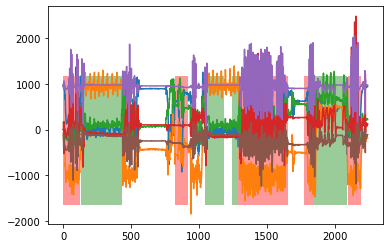

## DTW (dynamic time warping)

With this method, we have tried to detect movements in the series using DTW. For this experiment, we have taken an isolated movement present in the test series. We have applied DTW with a rolling window of the size of the isolated movement. Our results, on one hand we see a reduction of the norm of distances when a series of movement is detected (even if it is not the same movement compared), on the other hand, the computation time of DTW makes it not possible.
Below, we can see the single movement been compared with the series. We can see that it matches quite nicely:

 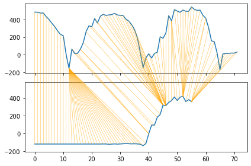

## CNN (convolutive neural network)

Our last try, was too use a CNN to classify the type of movement being done. The advantage of using a NN is the model which can learn on multiple different movements unlike DTW. To do the training of our model, we used the time series of exercise series. We have split them in windows. We have performed the training with a cross validation. Below we can see the results of all the cross validation syntetise into one chart. we can see the reduction of the loss:

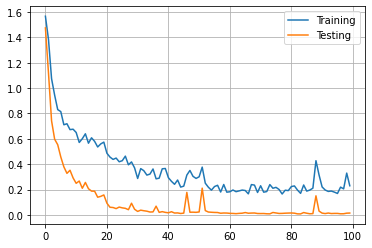

 At validation, the results were good enough, we have an accuracy of 1 but it's maybe due to the presence of only 5 classes. We can it in the confusion matrix:

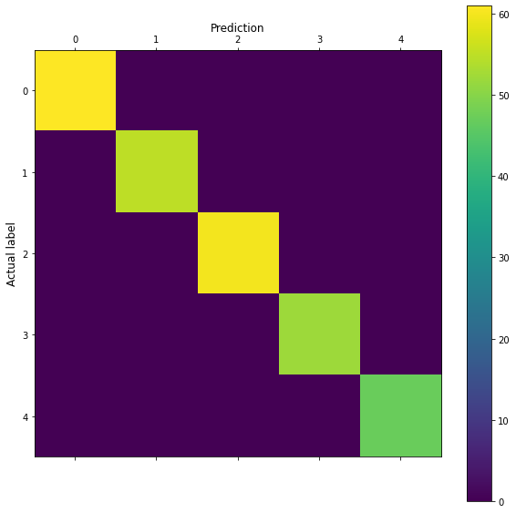

 Like FFT and DTW, we performed the CNN with a rolling windows on the test series. The results were also good. We were able to successfully identify each movement series accurately. For now, our model needs a random class to classify the parasite movements to avoid the classification of those ones as an exercise. Here we can see the class Squat in red and the class Bench in green:

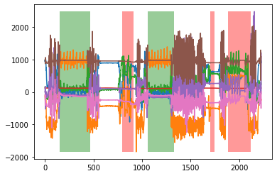

## Data extraction

With series of exercise extracted, we can now count the number of repetitions done. For this, we process the series and look at the pics indicating movements. We count the number of pics (a pic needs to be in the 90% of the highest values). Below is the pics that we have found in the series. We can see that they are indeed the pics of each repetition.

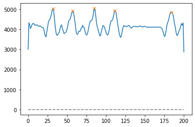

 With this method, we have successfully count the number of repetitions. We also have the number of burned calories during the workout. To get an estimation, we used MET (Metabolic Equivalent Task). To compute, we only need the weight of the user, the MET of the movement (class) and the duration of the series.

## Conclusion

We have succeed in our main objective. Now, to progress further, we could simply record more data and implement a mobile version in the form of an application. Create dashboard to allow the user to follow-up its current training and get a better visualization's experience. Also it would be great if we could add more type of exercises and more sample. Our model CNN is complex enough to support more classes.
In conclusion it was a really interesting project and maybe a future personal mobile app.

## Logbook

Here is a quick logbook of our work. Those logs have been rewrite in English so they aren't the original.

### Week 1

Achieved results: We have studied how we will implement the project, which models we will use. How we will capture the data and the boundary of the project.

Next steps: We will capture the data, analyses it, make the model and create the mobile application. But for now we will just capture the data, it is our priority.

### Week 2

Achieved results: Data of series of multiple repetitions have been correctly captured, parsed and cleaned.

Next steps: We will try basic models like KNN to see if we can identify the classes correctly. We will also analyze the data itself to see if anything is noticeable.

### Week 3

Achieved results: Data doesn't seem to show significantly differences between the classes. KNN is showing good results so far. we have an accuracy of ~0.85 of accuracy.

Next steps: We will try to use more robust model like CNN, LSTM and DTW. We will also record single repetition movement to feed the models.

### Week 4

Achieved results: We have record the single movements and we have implemented the LSTM but the result aren't really good.

Next steps: we will try to improve LSTM and test CNN.

### Week 5

Achieved results: CNN also give poor results with single repetition sample.

Next steps: we will try to use a FFT to see if we can is it in this project. We also will record a test training session.

### Holiday and revisions weeks

Achieved results: We have implemented FFT, DTW and CNN (over the series of multiple repetition windowed). We also have recorded the test training session. We have extract the number of repetition per series in the training session and count the amount of calories burned.
